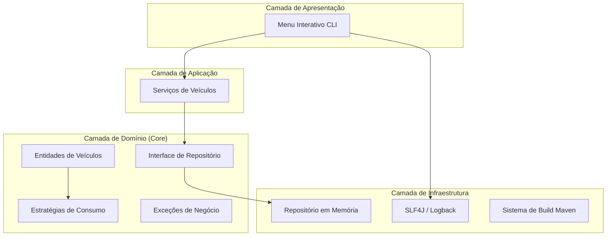

# 🏎️ Simulador de Veículos Especialista+ (Arquitetura Limpa)

[](https://github.com/RafaelReis22/Carros)
[](https://www.oracle.com/java/)
[](https://opensource.org/licenses/MIT)

Um sistema de simulação de veículos de alto desempenho construído com os princípios de **Arquitetura Limpa (Clean Architecture)** e **SOLID**. Este projeto demonstra engenharia de software de nível especialista através da separação de camadas, modelagem de domínio robusta e padrões de design avançados.

---

## 🏗️ Arquitetura de Referência

O sistema foi estruturado em camadas bem definidas para garantir baixo acoplamento e alta coesão, permitindo escalabilidade e facilidade de manutenção.

### Visão Geral dos Componentes (Mermaid)



---

## 🚀 Padrões de Design Implementados

- **Strategy Pattern**: Desacopla a lógica de consumo de combustível, permitindo que cada veículo calcule sua autonomia de forma dinâmica (Gasolina, Álcool, Modo Eco).
- **Factory Pattern**: Centraliza a criação de veículos através da `VehicleFactory`, abstraindo a complexidade de configuração inicial.
- **Repository Pattern**: Separa o domínio da forma como os dados são persistidos, facilitando futuras migrações para bancos de dados reais.

---

## 🛠️ Stack Tecnológica

- **Linguagem**: Java 17
- **Geração de Build**: Maven
- **Cobertura de Código**: JaCoCo
- **Testes**: JUnit 5, Mockito
- **Logging**: SLF4J + Logback
- **Padronização**: Arquitetura em Camadas (Domain-Driven Design / Clean Arch)

---

## 📖 Estrutura do Projeto

```text
src/
├── main/java/com/automotive/simulator//
│   ├── domain/               # Regras de negócio principais
│   │   ├── entities/        # Modelos e estratégias de consumo
│   │   ├── exceptions/      # Mensagens de erro de negócio
│   │   └── repositories/    # Interfaces de persistência
│   ├── application/          # Casos de uso e lógica de fluxo
│   ├── infrastructure/       # Implementações técnicas (DB, Log)
│   └── presentation/         # Ponto de entrada (Main CLI)
└── test/java/com/automotive/simulator/  # Testes unitários JUnit 5
```

---

## 🚦 Como Rodar

1. **Pré-requisitos**: Certifique-se de ter o Java 17 e o Maven instalados.
2. **Compilar e Testar**:

   ```bash
   mvn clean verify
   ```

3. **Executar a Simulação**:

   ```bash
   mvn exec:java -Dexec.mainClass="com.automotive.simulator.presentation.Main"
   ```

---

## 📄 Licença

Distribuído sob a licença MIT. Veja `LICENSE` para mais informações.

---
*Criado com ❤️ para o ecossistema brasileiro de desenvolvimento.*
